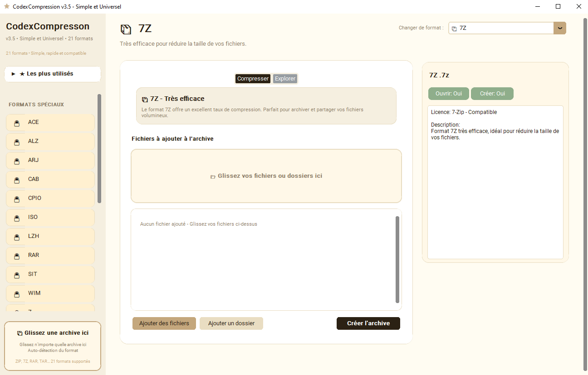

<p align="center">

</p>

# CodexCompression v3.5.4 - Simple et Universel

<p align="center">

</p>

<p align="center">

### ⬇ [Télécharger CodexCompression v3.5.4 (Windows)](https://github.com/CircaFrax/CodexCompression/releases/download/3.5.4/CodexCompression_v3.5.4.zip)
`SHA256: 7fa03f38bd0caae07eff8a0291884b3695f5130e56b7ef8a20db68d2d2ac0f3d`

</p>

# L'archiveur qui fait le boulot. Sans installation. Sans cloud. Sans pub.**

> Portable Offline - 21 formats

## Le problème
Windows sait faire du ZIP. À moitié. Il aplatit tout, oublie l'arborescence, et pour le reste il vous propose d'installer 3 logiciels, une barre d'outils et un compte.

## Aperçu

*Compresser à gauche, explorer à droite – tree /f conservé, 100% offline*

## La solution Codex v3.5.4
CodexCompression est un seul .exe qui remplace WinRAR / 7-Zip pour 95% des usages, sans rien installer.

**21 formats supportés • Simple, rapide et compatible**

Glisser-déposer vrai : fichier, dossier complet ou archive directement sur l'exe
Arborescence conservée : dossier avec fichiers + images → récupéré tel quel
Explorer intégré : double-clic pour naviguer, ouvrir sans tout extraire
Formats créables : ZIP, 7Z, TAR, GZ, BZ2, XZ, JAR
Lecture seule : RAR, CAB, ISO, CPIO, ACE, ARJ, LZH, SIT, ALZ, Z, WIM, PAK, WAD, ARC
Popup validation verte avec nom du fichier
Interface épurée : Les plus utilisés repliés par défaut
Portable : un seul .exe

### Utilisation

**Lancer CodexCompression.exe**

**Onglet Compresser :**
Glisser fichiers ou dossiers dans la zone
Ou Ajouter des fichiers / Ajouter un dossier
Vérifier la liste
Créer l'archive → choisir destination → popup

**Onglet Explorer :**
Glisser une archive dans la zone dédiée (ou sur l'exe)
Ou Ouvrir une archive
Naviguer avec Retour, double-clic dossier
Double-clic fichier pour ouvrir
Extraire tout → choisir dossier

**Astuce :** Glissez une archive sur l'exe Windows, elle s'ouvre automatiquement.

### Structure

```
CodexCompression/
├───CodexCompression.exe
├───LICENCE.md
└───THIRD_PARTY_LICENSES.md
```

### Confidentialité
- Zéro réseau : tout sur votre PC, pas de télémétrie
- Portable : n'écrit que l'archive demandée
- Offline : fonctionne sans internet
- Voir THIRD_PARTY_LICENSES.md

### Roadmap

- [x] v3.3.2 - Single EXE, tri clean, Essentiels repliables, drag & drop
- [x] v3.3.3 - Prévisualisation images
- [x] v3.5.4 - 21 formats, Simple et Universel, interface épurée
- [ ] v3.6.0 - Histoire des formats
- [ ] v4.0.0 - Suite Codex + Chiffrement

### Licence
CircaFrax Proprietary Freeware - Gratuit même en entreprise
Voir LICENCE.md

---
**Fait partie de la suite Codex** — des logiciels qui s'utilisent sans installation, comme en 1998, mais en mieux.
**v3.5.4 FINAL CLEAN** - 21 formats
