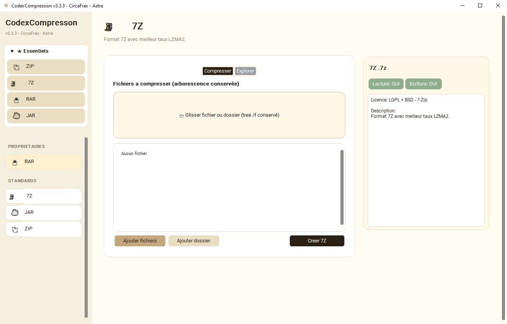

  

CodexCompression v3.3.4

  

⬇️ Télécharger CodexCompression v3.3.4 (Windows)
SHA256: A_REMPLACER_APRES_BUILD

L'archiveur qui fait le boulot. Sans installation. Sans cloud. Sans pub.

Portable [blocked]
Offline [blocked]
Python [blocked]

Le problème
Windows sait faire du ZIP. À moitié. Il aplatit tout, oublie l'arborescence, et pour le reste il vous propose d'installer 3 logiciels, une barre d'outils et un compte.

Aperçu
 *Compresser à gauche, explorer à droite – tree /f conservé, 100% offline*
La solution Codex
CodexCompression est un seul .exe qui remplace WinRAR / 7-Zip pour 95% des usages, sans rien installer.

Glisser-déposer vrai : fichier ou dossier complet, on garde Dossier/Sous-dossier/fichier comme tree /f
Arborescence conservée : tu mets un dossier avec 4 fichiers + une image → tu récupères le dossier avec son contenu + l'image à la décompression
Explorer intégré : double-clic pour naviguer, ouvrir un fichier sans tout extraire, bandeau avec chemin
4 formats, clean : ZIP, 7Z, JAR créables + RAR en lecture seule (licence RARLAB oblige, on ne peut pas créer de .rar)
Popup de validation : ✅ verte avec icône étoile, Archive créée + nom du fichier, bouton bien visible
Portable : un seul .exe, _Assets/icons/ avec l'étoile, pas de registre, pas de favorites.json qui traîne
Tri intelligent : 7Z avant JAR/RAR/ZIP (chiffres d'abord), Essentiels repliables
Aucune installation. Fonctionne sur clé USB.

📖 Utilisation
Lancer CodexCompression.exe
Onglet Compresser :
Glisser un fichier ou un dossier entier dans la zone 📂
Ou Ajouter fichiers / Ajouter dossier (le contenu est expandé, pas le dossier vide)
Vérifier la liste tree /f en dessous
Cliquer Créer ZIP / 7Z / JAR → choisir la destination → popup ✅
Onglet Explorer :
Glisser une archive ou Ouvrir archive
Naviguer avec ← Retour, double-clic sur dossier
Double-clic sur fichier pour l'ouvrir en temp
Extraire tout → choisis le dossier → arborescence restituée
📁 Structure
CodexCompression/
├───CodexCompression.exe
├───_Assets/
│   └───icons/
│       └───CodexCompresson.ico
├───_Doc/
│   ├───LICENCE.md
│   ├───LICENSE.md
│   └───THIRD_PARTY_LICENSES.md
└───README.md
Version dev :

_Code/
├───CodexCompression_v3.3.4_CREAM.py
└───modules/
    ├───mod_zip.py
    ├───mod_7z.py
    ├───mod_jar.py
    └───mod_rar.py  (lecture seule)
🔒 Confidentialité
Zéro réseau : tout se passe sur votre PC, pas de télémétrie
N'écrit que ce que vous demandez : l'archive que vous créez
customtkinter MIT + tkinterdnd2 MIT + Pillow HPND + rarfile ISC + unRAR freeware (extraction seule) - voir THIRD_PARTY_LICENSES.md
🗺️ Roadmap
 v3.3.3 - Single EXE, tri clean, Essentiels repliables, drag & drop partout
 v3.3.4 - Popup validation avec icône, arborescence tree /f, RAR bloqué en création (licence)
 v3.4.0 - Prévisualisation images dans l'explorer + recherche
 v3.5.0 - Chiffrement ZIP AES
 v4.0.0 - Suite Codex : CodexArchive & CodexView
📄 Licence
CircaFrax Proprietary Freeware v1.0

Vous pouvez utiliser et partager l'exécutable gratuitement, pour toujours, où vous voulez, perso ou pro. Vous ne pouvez pas voler le code ni revendre l'exe seul. Le code source reste privé.

Fait partie de la suite Codex — des logiciels qui s'utilisent sans installation, comme en 1998, mais en mieux.

